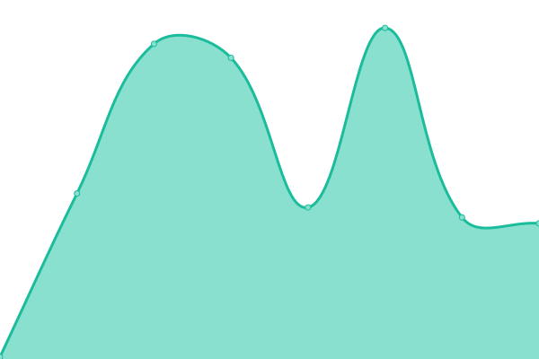
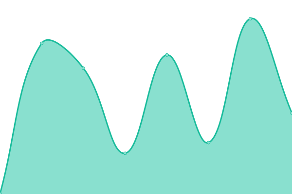

# [📈 Live Status](https://upptime.github.io/upptime): <!--live status--> **🟩 All systems operational**

This repository contains the open-source uptime monitor and status page for [Upptime](https://upptime.js.org), powered by [Upptime](https://github.com/upptime/upptime).

With [Upptime](https://upptime.js.org), you can get your own unlimited and free uptime monitor and status page, powered entirely by a GitHub repository. We use [Issues](https://github.com/upptime/upptime/issues) as incident reports, [Actions](https://github.com/geeks121/upkan/actions) as uptime monitors, and [Pages](https://upptime.github.io/upptime) for the status page.

<!--start: status pages-->
<!-- This summary is generated by Upptime (https://github.com/upptime/upptime) -->
<!-- Do not edit this manually, your changes will be overwritten -->
<!-- prettier-ignore -->
| URL | Status | History | Response Time | Uptime |
| --- | ------ | ------- | ------------- | ------ |
|  [Google](https://www.google.com) | 🟩 Up | [google.yml](https://github.com/geeks121/upkan/commits/HEAD/history/google.yml) | 

 94ms
     
 | 

<a href="https://up.zapnet.my.id/history/google">100.00%</a>
    

|  [Beefy yield farming](https://beefy.finance) | 🟩 Up | [beefy-yield-farming.yml](https://github.com/geeks121/upkan/commits/HEAD/history/beefy-yield-farming.yml) | 

 335ms
     
 | 

<a href="https://up.zapnet.my.id/history/beefy-yield-farming">100.00%</a>
    

|  [miripgeeks](https://miripgeeks.blogspot.com) | 🟩 Up | [miripgeeks.yml](https://github.com/geeks121/upkan/commits/HEAD/history/miripgeeks.yml) | 

 266ms
     
 | 

<a href="https://up.zapnet.my.id/history/miripgeeks">100.00%</a>
    

|  [warp unlimited 1](https://warp-unlimited-geeks121.cloud.okteto.net/) | 🟩 Up | [warp-unlimited-1.yml](https://github.com/geeks121/upkan/commits/HEAD/history/warp-unlimited-1.yml) | 

 272ms
     
 | 

<a href="https://up.zapnet.my.id/history/warp-unlimited-1">99.22%</a>
    

|  [warp nh](https://warp-unlimited-fauzinurhaqin.cloud.okteto.net/) | 🟩 Up | [warp-nh.yml](https://github.com/geeks121/upkan/commits/HEAD/history/warp-nh.yml) | 

 297ms
     
 | 

<a href="https://up.zapnet.my.id/history/warp-nh">99.76%</a>
    

|  [warp xbeefy](https://warp-unlimited-xbeefy.cloud.okteto.net/) | 🟩 Up | [warp-xbeefy.yml](https://github.com/geeks121/upkan/commits/HEAD/history/warp-xbeefy.yml) | 

 242ms
     
 | 

<a href="https://up.zapnet.my.id/history/warp-xbeefy">99.76%</a>
    

<!--end: status pages-->

[**Visit our status website →**](https://geeks121.github.io/upkan/)

## 📄 License

- Powered by: [Upptime](https://github.com/upptime/upptime)
- Code: [MIT](./LICENSE) © [Upptime](https://upptime.js.org)
- Data in the `./history` directory: [Open Database License](https://opendatacommons.org/licenses/odbl/1-0/)
